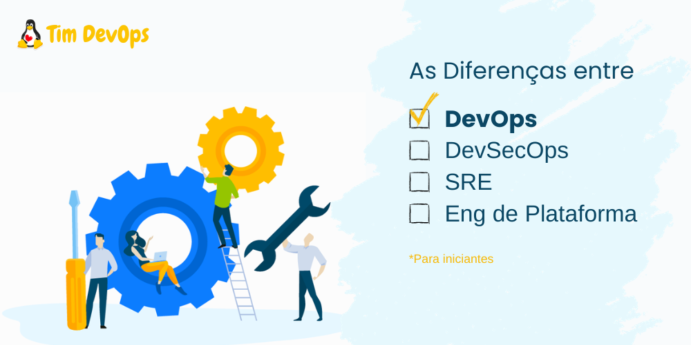
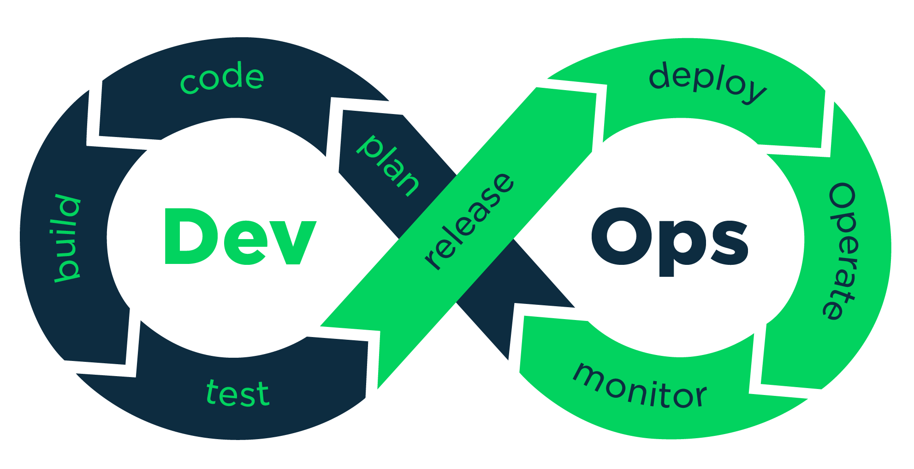
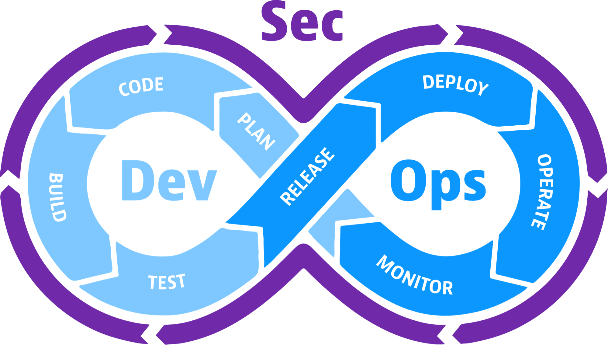
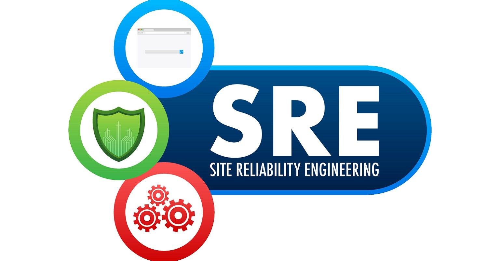
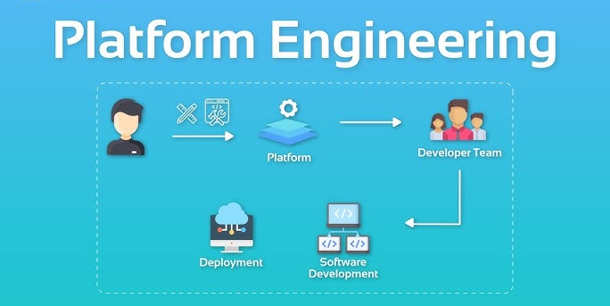

+++
author = "Renato Ruis (Tim)"
title = 'As Diferenças entre DevOps, DevSecOps, SRE e Engenheiro de Plataforma'
description = "Para Iniciantes"
date = 2023-09-20
+++

Salve!

Hoje, vamos falar do universo da engenharia de software e explorar as nuances entre quatro papéis essenciais: **_DevOps, DevSecOps, SRE (Site Reliability Engineering) e Engenheiro de Plataforma_**. Embora essas funções sejam cruciais para o sucesso das operações de TI, é importante destacar que **nem tudo é 100% certo** no mundo dinâmico da tecnologia. Vamos ver um pouco essas diferenças.

## DevOps: A Colaboração no Centro

O DevOps é como uma cola que une equipes de desenvolvimento e operações. Aqui estão alguns pontos-chave:

- **Colaboração: **DevOps enfatiza a colaboração contínua entre equipes de desenvolvimento e operações para garantir entregas de software mais rápidas e confiáveis.

- **Automação:** A automação de processos é uma parte central do DevOps, permitindo a entrega contínua e a implantação automatizada.

- **Cultura:** É uma filosofia que promove uma cultura de aprendizado contínuo e melhoria.

## DevSecOps: Segurança em Primeiro Lugar

O DevSecOps leva o conceito do DevOps um passo adiante, incorporando segurança desde o início: Isso não quer dizer que não devem trabalhar juntos um DevOps e DevSecOps, na verdade os dois se complementam.

- **Segurança Integrada:** A segurança é integrada ao ciclo de vida de desenvolvimento, não como uma reflexão tardia.

- **Testes de Segurança:** Ferramentas de automação ajudam a identificar vulnerabilidades e problemas de segurança.

- **Responsabilidade Compartilhada: **Todos na equipe são responsáveis pela segurança.

## SRE (Site Reliability Engineering): Mantendo as Coisas Funcionando

SRE é sobre garantir que sistemas e aplicativos sejam confiáveis e escaláveis:

- **Confiabilidade:** O foco principal é manter sistemas altamente confiáveis, minimizando interrupções.

- **Engenharia:** Usa princípios de engenharia de software para resolver problemas operacionais.

- **SLIs, SLOs, SLAs: **Mede a confiabilidade usando indicadores de serviço (SLIs), objetivos de serviço (SLOs) e acordos de nível de serviço (SLAs).

## Engenheiro de Plataforma: Habilitando a Infraestrutura

Os Engenheiros de Plataforma são responsáveis pela infraestrutura que suporta aplicativos:

- **Infraestrutura como Código (IaC): **Desenvolve e mantém a infraestrutura usando código.

- **Orquestração de Contêineres:** Gerencia contêineres e orquestração para implantação eficiente.

- **Escalabilidade:** Garante que a infraestrutura possa escalar conforme necessário.

Aqui está uma tabela rápida de comparação:

    Papel          | Enfoque Principal              | Ferramentas Comuns
    ---------------|--------------------------------|-------------------------------
    DevOps         | Colaboração, Automação         | Jenkins, Ansible, Docker
    DevSecOps      | Segurança Integrada            | OWASP ZAP, Nessus, Vault
    SRE            | Confiabilidade, Engenharia     | Prometheus, Grafana, Kubernetes
    Platform Eng   | Infraestrutura, Escalabilidade | Terraform, Kubernetes, Docker

> Lembre-se de que, no mundo real, as fronteiras entre esses papéis podem ser borradas, e as organizações adaptam esses conceitos às suas necessidades específicas. O importante é manter o foco na colaboração, na automação e na segurança, independentemente do título que você use.

Neste dinâmico ecossistema, a adaptação é a chave, e **aprender continuamente é essencial**. Espero que esta exploração simplista tenha ajudado a compreender melhor as diferenças entre DevOps, DevSecOps, SRE e Engenheiro de Plataforma.

Se você tiver alguma dúvida ou quiser compartilhar suas experiências, sinta-se à vontade para comentar abaixo. Juntos, continuamos a explorar e evoluir no emocionante mundo da tecnologia!
