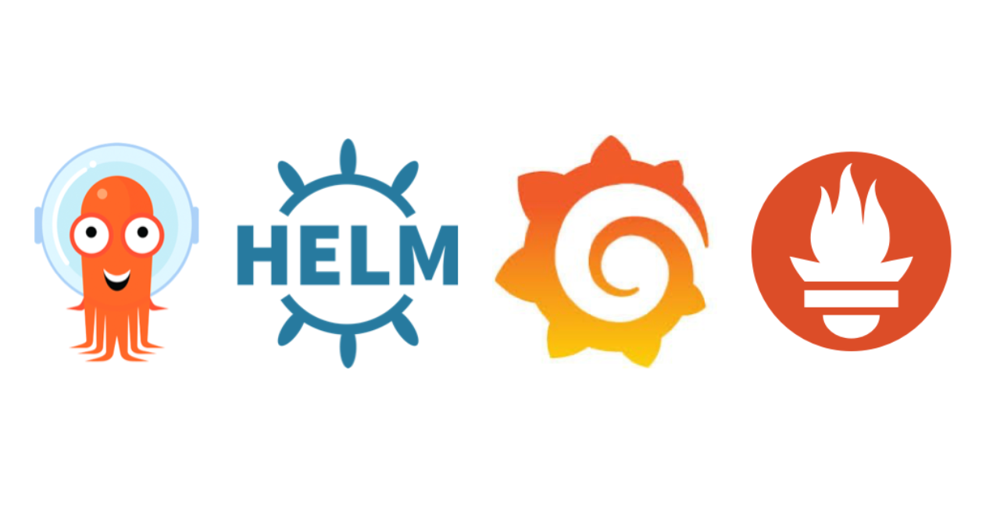

+++
author = "Renato Ruis (Tim)"
title = 'Implantando Prometheus e Grafana no Kubernetes usando o ArgoCD'
date = 2023-07-21

+++

## Implantando Prometheus e Grafana no Kubernetes usando o ArgoCD

**Introdução ao Prometheus, Grafana e ArgoCD**

**Prometheus** é uma solução de monitoramento para registrar e processar séries temporais puramente numéricas. Ele coleta, organiza e armazena métricas juntamente com identificadores únicos e marcação de data/hora.

Prometheus é um software de código aberto que coleta métricas de alvos por meio de “scraping” nos endpoints HTTP de métricas. Os “targets” suportados incluem plataformas de infraestrutura (por exemplo, Kubernetes), aplicativos e serviços (por exemplo, sistemas de gerenciamento de bancos de dados). Junto com o serviço complementar **AlertManager**, o Prometheus é uma ferramenta flexível para coleta de métricas e alertas.

**Grafana:** também é um software de código aberto que permite consultar, visualizar, alertar e explorar métricas, logs e rastreamentos onde quer que estejam armazenados.

Como ferramenta de visualização, o Grafana é um componente popular em stacks de monitoramento, frequentemente usado em combinação com bancos de dados de séries temporais como InfluxDB, Prometheus e Graphite; e outras plataformas de monitoramento como Sensu, Icinga, Checkmk, Zabbix, Netdata e PRTG; SIEMs como Elasticsearch e Splunk; e etc

Continuando….

**ArgoCD**: é uma ferramenta declarativa de entrega contínua GitOps para Kubernetes. ArgoCD é implementado como um controlador do Kubernetes que monitora continuamente os aplicativos em execução e compara o estado atual ao estado desejado. Um aplicativo implantado cujo estado atual difere do estado desejado é considerado “fora de sincronia” (OutOfSync).

**Helm Charts: **Helm ajuda você a gerenciar aplicativos do Kubernetes — Helm Charts ajudam você a definir, instalar e atualizar até mesmo os aplicativos Kubernetes mais complexos. Helm é uma ferramenta de DevOps que simplifica a instalação e o gerenciamento de aplicativos Kubernetes. A ferramenta empacota arquivos de configuração em um formato chamado “charts”.

Vamos lá!

**Pré-requisitos**

- ArgoCD instalado em um cluster em execução (se ainda não o fez, consulte [esta documentação](https://argo-cd.readthedocs.io/) para configurá-lo).

- Um repositório do GitHub conectado à aplicação ArgoCD.

**Configurando seus manifestos**

Crie 2 arquivos na pasta do repositório que você conectou ao ArgoCD e personalize os seguintes valores usando os Helm Charts globais do Prometheus e Grafana.

_Prometheus.yaml_

    apiVersion: argoproj.io/v1alpha1
    kind: Application
    metadata:
      name: prometheus
      namespace: argocd
      finalizers:
        - resources-finalizer.argocd.argoproj.io
    spec:
      destination:
        namespace: monitoring
        server: https://kubernetes.default.svc
      project: default
      sources:
        - repoURL: https://github.com/<git-username>/<git-repo>.git
          targetRevision: HEAD
          ref: <customizable reference>
        - repoURL: https://prometheus-community.github.io/helm-charts/
          chart: prometheus
          targetRevision: 19.7.2
          helm:
            values: |
                server:
                  service:
                    type: LoadBalancer
      syncPolicy:
        automated:
          prune: true
          selfHeal: true
        syncOptions:
          - CreateNamespace=true

_O arquivo YAML acima cria o aplicativo Prometheus a partir do Helm Chart do Prometheus e o expõe como um LoadBalancer, juntamente com outros campos personalizáveis. Consulte aqui se precisar de mais valores._

grafana.yaml

    apiVersion: argoproj.io/v1alpha1
    kind: Application
    metadata:
      name: grafana
      namespace: argocd
      finalizers:
        - resources-finalizer.argocd.argoproj.io
    spec:
      destination:
        namespace: monitoring
        server: https://kubernetes.default.svc
      project: default
      sources:
      - repoURL:  https://github.com/<git-username>/<git-repo>.git
        targetRevision: HEAD
        ref: <customizable reference>
      - repoURL: https://grafana.github.io/helm-charts
        chart: grafana
        targetRevision: 6.52.2
        helm:
          values: |
            service:
              type: LoadBalancer
            datasources:
              datasources.yaml:
                apiVersion: 1
                datasources:
                  - name: Prometheus
                    type: prometheus
                    url: http://prometheus-server.monitoring.svc.cluster.local
                    access: proxy
                    isDefault: true
                  - name: loki
                    type: loki
                    url: http://loki.monitoring.svc.cluster.local
                    access: proxy
            dashboardProviders:
              dashboardproviders.yaml:
                apiVersion: 1
                providers:
                  - name: "default"
                    orgId: 1
                    folder: ""
                    type: file
                    disableDeletion: false
                    editable: true
                    options:
                      path: /var/lib/grafana/dashboards/default
            dashboards:
              default:
                kubernetes:
                  gnetId: 10000
                  revision: 1
                  datasource: Prometheus
      syncPolicy:
        automated:
          prune: true
          selfHeal: true
        syncOptions:
        - CreateNamespace=true

_O arquivo YAML acima cria o aplicativo Grafana a partir do Helm Chart do Grafana. Esse arquivo faz mais do que apenas criá-lo e expô-lo como um LoadBalancer. Após expô-lo como um balanceador de carga, ele adiciona duas fontes de dados, que são Loki e Prometheus. Em seguida, ele adiciona um provedor de dashboards e, por fim, adiciona um painel chamado painel 10000. A maioria dessas ações seria feita manualmente, mas com esse arquivo, elas podem ser facilmente declaradas aqui._

Agora que configuramos com sucesso nossos manifestos e garantimos que a pasta do repositório com esses manifestos esteja conectada à nossa aplicação ArgoCD, o próximo passo seria verificar se eles foram implantados com sucesso na aplicação. Caso contrário, só precisamos atualizar ou sincronizar o aplicativo base no ArgoCD em que eles estão e eles deverão ser refletidos.

**Concluíndo**

Pra finalizar, implantar a stack de monitoramento Prometheus e Grafana no Kubernetes usando o GitOps com ArgoCD oferece inúmeras vantagens e simplifica todo o processo de monitoramento. Ao aproveitar o poder do GitOps, as organizações podem alcançar uma observabilidade, escalabilidade e confiabilidade aprimoradas em sua infra Kubernetes.

A adoção do Prometheus permite uma coleta robusta de métricas, monitoramento e alerta, possibilitando a identificação e resolução proativa de problemas. Com os dashboards e recursos de visualização intuitivos do Grafana, as equipes podem obter insights valiosos sobre o desempenho do sistema e tomar decisões informadas para otimizar a alocação de recursos e melhorar a eficiência geral.

O ArgoCD atua como uma ferramenta poderosa para implantações orientadas pelo GitOps, garantindo implantações consistentes e auditáveis de aplicativos em clusters Kubernetes. Com o ArgoCD, as organizações podem automatizar o processo de implantação, reduzir erros manuais e manter uma pilha de monitoramento confiável e escalável.

Em resumo, implantar essa stack vai facilitar muito seu dia a dia :)

Caso não tenha conseguido ou tenha tido algum problema por favor me procure aqui nos comentários ou no linkedin :)

ps: este post é uma tradução livre e adaptada do [Bright Odey](undefined)
